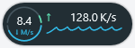
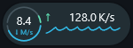
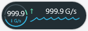
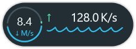
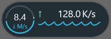

# Compact Floating Rate Display — validation

日期：2026-09-19

三个 ticket 的**代码实现已完成**；状态为 `ready-for-human`，表示等待下面明确列出的人工验收，并非所有验收条目都已通过。

## 实现

- 01：144×48 DIP 深色胶囊，3 DIP 阴影边距，Direct2D / DirectWrite / WIC 预乘 BGRA；保留当前格式化读数，下载优先布局，字体测量适配。主体和鼠标穿透阴影分别提交到原生分层窗口。
- 02：上传上半环逆时针、下载下半环顺时针；0.35 平滑，最近 48 个样本共用峰值，1000 bytes/s 下限；原始零值立即清空亮弧。下载趋势只包含已有样本。网络选择代次使手动选择与自动回退统一触发历史重置。
- 03：浮动窗口自身处理 DPI 和显示变化；有效保存位置保持，屏外位置归位；失败保留成功位图并可重建目标；复用绘图资源。更新 CONTEXT.md，保持任务栏的字体尺寸和主题约定独立。

## 自动验证结果

从仓库根目录运行：

```powershell
cmake -S . -B build -A x64
cmake --build build --config Release
ctest --test-dir build -C Release --output-on-failure
```

最终结果：Release 构建成功，**3/3 CTest 通过**。

| 检查 | 结果 |
| --- | --- |
| WinMonCoreTests | 现有核心测试及 NIC 手动选择／消失回退的图形历史重置信号通过 |
| FloatingRateRendererTests | 最终位图尺寸、透明外缘、连续 Alpha、预乘颜色；独立 0／0.5／1 半环方向、缩短、峰值过期、零／负／非有限输入、重置、空／少量／满历史通过 |
| DPI／字体矩阵 | 96／120／144／192 DPI × Segoe UI／Arial Black × 0.0 K/s／999.9 K/s／999.9 G/s／123456789.0 G/s 通过；不使用字体金图 |
| 失败及恢复 | 无效 DPI 拒绝且保留成功位图、无效窗口提交失败、释放目标后重建且保持采样状态通过；未人为注入真实 Direct2D 设备丢失 |
| FloatingWindowTests | 实际 MFC RateStrip 浮动窗口及 UpdateLayeredWindow：144 DPI 尺寸、置顶／工具窗口／不激活、位置保留／移动／屏外恢复、右键通知路由、阴影穿透样式、两层同步及销毁通过 |
| 生命周期资源 | 连续 20 次显示／关闭后 GDI 对象计数不增长；这不是长期内存压力测试 |

最初位图测试在未实现绘图时失败；半环测试在未绘制活动弧时失败；网络重置信号测试在未记录选择变更时失败。各切片实现后对应检查转绿。

## 图像证据

以下为最终渲染结果，非生成原型。放大图使用最近邻 4× 放大，供检查原始像素边缘，不能当成原尺寸观感。

**100% / 96 DPI 离屏原尺寸预览（150×54 px，含阴影）**：由与产品相同的绘图单元产生，并分别合成到深浅背景；不冒充 96 DPI 真实桌面截图。





[96 DPI 像素细节 4×](evidence/actual-size-light-4x.png)

**真实原生窗口截图（当前显示器 150% / 144 DPI，225×81 px）**：原生测试通过真实分层窗口提交，再从桌面捕获，在测试用深浅背景窗口上检查。




[原生窗口像素细节 4×](evidence/native-light-4x.png)

已目视检查固定胶囊、读数、细线与深浅背景边缘。原生测试数据是确定样本，不代表一次实际网络传输记录。100% 真实桌面截图需要在 96 DPI 显示器上补充。

## Standards

初审发现 1 项问题：带 Alpha 的阴影仅返回 `HTTRANSPARENT` 不能保证跨进程点击穿透。已改为独立的 `WS_EX_TRANSPARENT | WS_EX_LAYERED | WS_EX_NOACTIVATE` 阴影窗口，主体不包含阴影像素。复审无剩余可执行问题；无硬性规范违反。

## Spec

初审同样发现阴影输入穿透问题；修复后复审无新的明确规格缺陷。缺少的人工设备验收保留如下，不算作已通过。

## 待人工验收

Computer Use 成功初始化，但没有列出 Win Mon 的无标题工具窗口；未继续使用猜测句柄或坐标操作。真实原生自动检查不替代以下人工交互：

1. 启动 `build/Release/WinMon.exe`，通过 Tray Icon 打开菜单，反复切换 Show Floating Display；左键拖动时确认当前应用不失焦，右键确认完整 Operator Menu。点击阴影下另一进程的可点击控件，确认穿透。
2. 观察实际网络上传／下载及闲置，切换 Network to Monitor，确认曲线从新历史开始。切换较宽字体，确认紧凑字号和任务栏原字号各自正常。
3. 正常退出并重新启动，确认可见性和位置持久化。自动测试已验证 ShowFloating 接收保存坐标后的恢复，但未通过菜单完成真实进程重启演示。
4. 在不同 DPI 的物理显示器之间拖动、移除显示器，确认尺寸、字体、阴影、归位及位置保存；本次仅有真实 144 DPI 窗口，其他 DPI 为离屏测试。
5. 实际重启 Explorer，确认 Tray Icon 和 Rate Strip 恢复且浮动显示仍可操作。现有 ShellLifecycle 核心恢复测试通过，但本次没有重启用户的 Explorer。
6. 在 96 DPI 桌面补拍深浅背景真实原尺寸截图，并长期观察资源使用。当前只完成了短期 GDI 对象检查。

验收完成后，在各 ticket 勾选剩余条目并改为 `resolved`。测试过程临时修改的浮动显示开关／位置注册表值已恢复，启动的测试实例已退出。

## 视觉反馈修订

整体尺寸增加约 9%，使用矢量变换在目标 DPI 直接重新栅格化；3 DIP 阴影边距不变。暗轨道和亮弧左右两端均断开约 2 DIP。新增四种 DPI 下空闲轨道与双满值亮弧的断口像素检查；Release 构建与全部 3 项 CTest 再次通过。图像证据已替换为本次结果。
